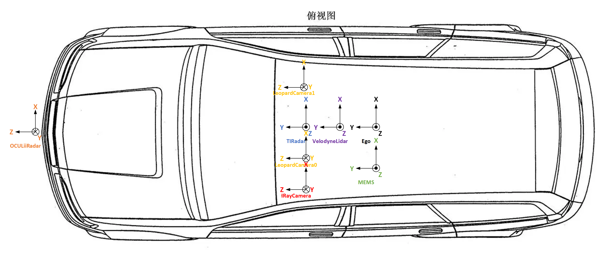
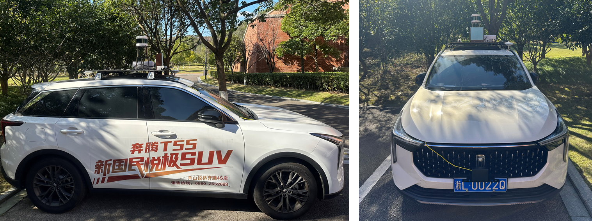
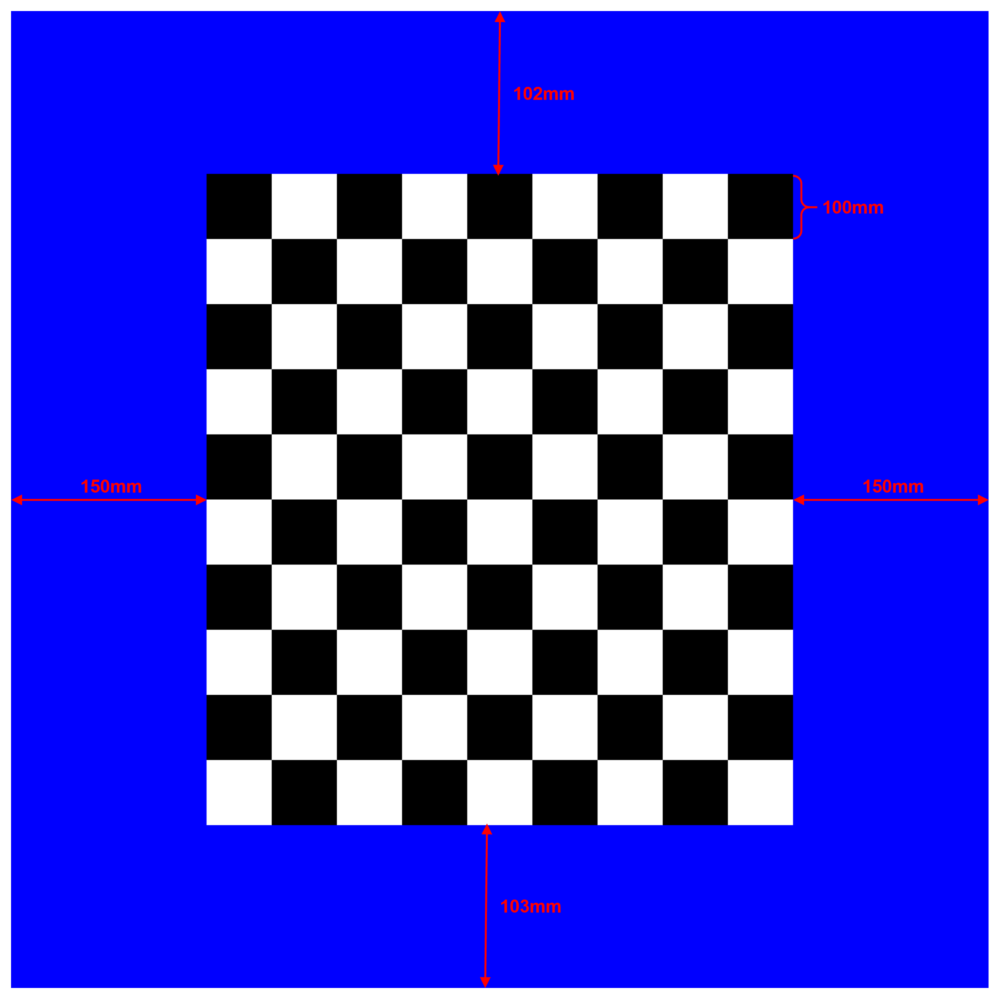
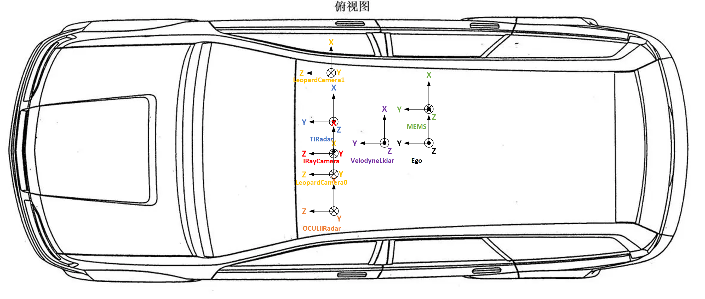
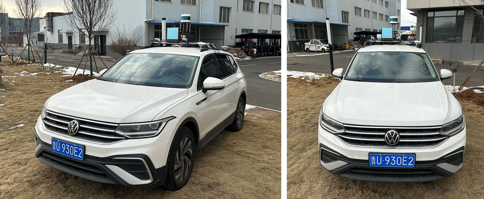

# Note

update based on sensors_calibration_v2: [Aiuan/sensors_calibration_v2: multi-sensors calibration data and codes for ourDataset_v2 (github.com)](https://github.com/Aiuan/sensors_calibration_v2)

# zhoushan

# yantai

