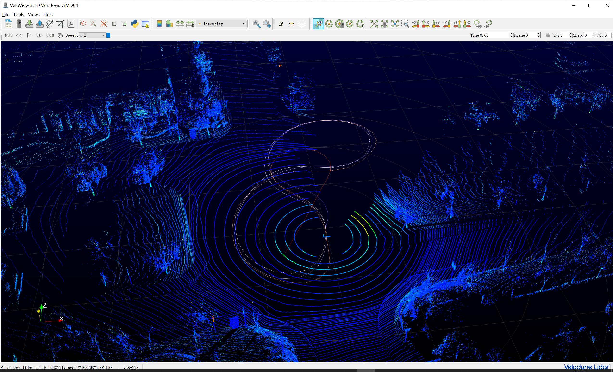
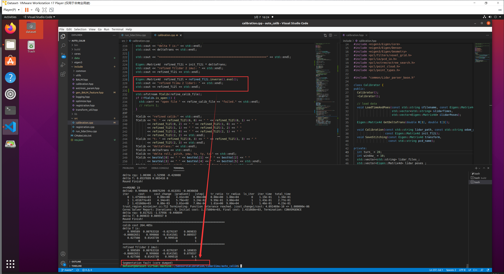

# MEMS_to_VelodyneLiadr_extrinsic标定过程所遇见的问题

使用[SensorsCalibration/lidar2imu at master · PJLab-ADG/SensorsCalibration (github.com)](https://github.com/PJLab-ADG/SensorsCalibration/tree/master/lidar2imu)进行标定

## 数据检查

按照要求采集绕八字数据

## eigen库求逆矩阵

eigen库求逆矩阵有一定问题
