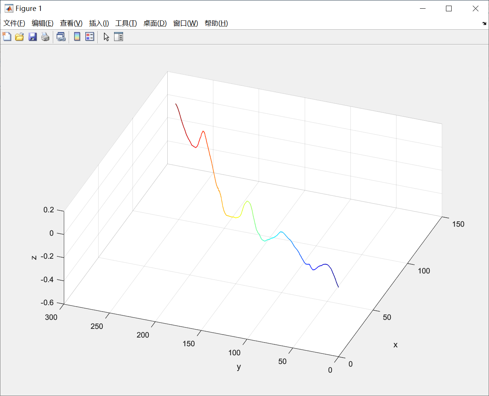
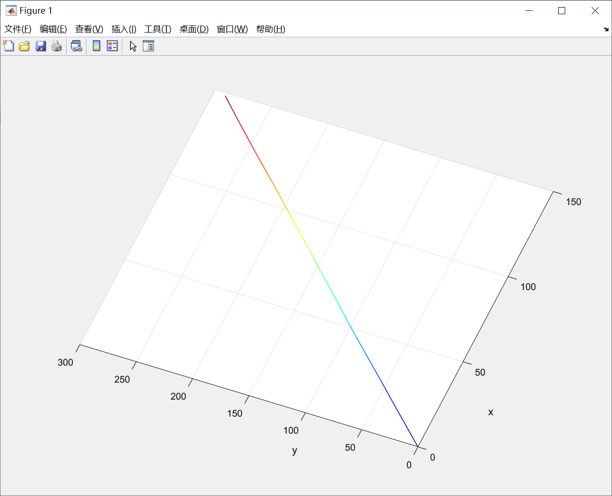
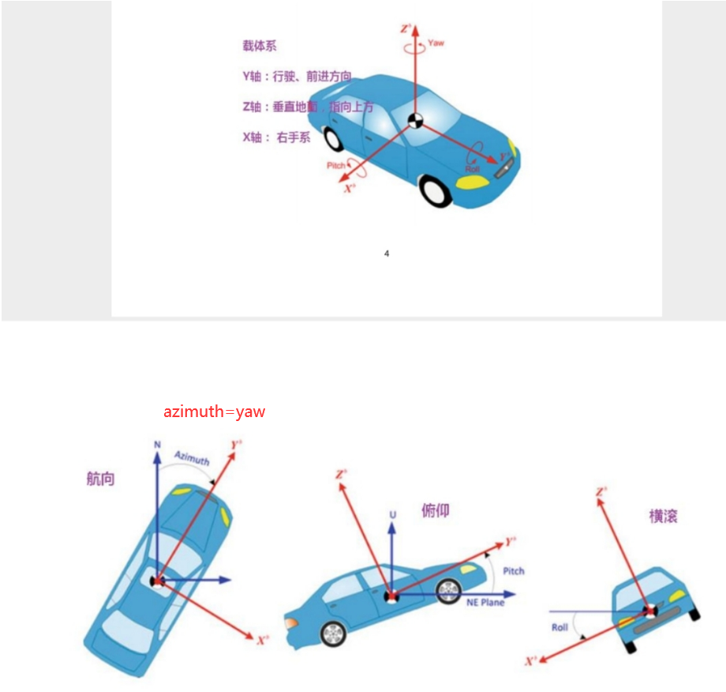
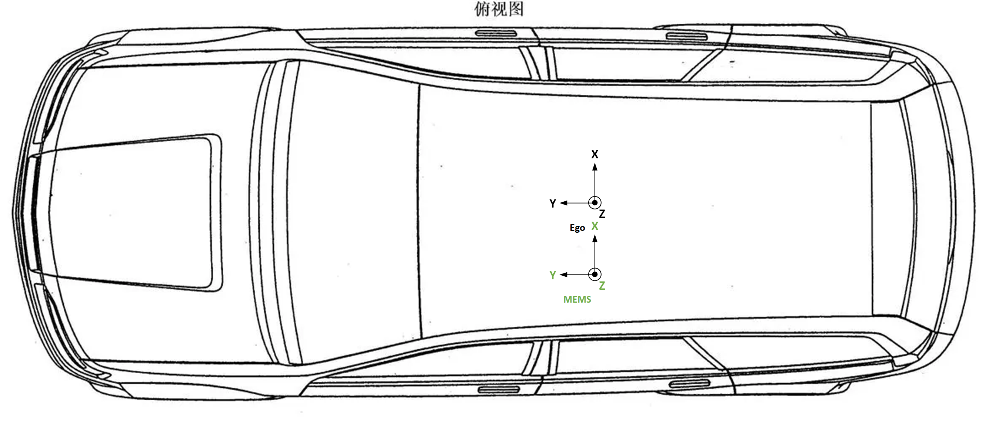

# MEMS_to_Vehicle_extrinsic标定过程中遇见的问题总结

使用[SensorsCalibration/imu_heading at master · PJLab-ADG/SensorsCalibration (github.com)](https://github.com/PJLab-ADG/SensorsCalibration/tree/master/imu_heading)进行标定

世界坐标系：东北天（enu）坐标系，y轴朝北，x轴朝东

观察所采集数据：低速直线行驶，z方向上可能有一点抖动（数量级很小）



组合惯导测得的azimuth：当车辆朝向正北时为0°，正东时为90°，正南时为180°，正西时为270°



## 问题一：标定程序所定义坐标系与我们实验所定义坐标系不一致

我们实验所定义的坐标系：车辆和组合导航皆为右手系，x轴指向右方，y轴指向前方



原始标定程序坐标系：车辆和组合导航皆为右手系，x轴指向前方，y轴指向左方

> 为了解决坐标系不统一问题，修改imu_heading.cpp第249行

```c++
// ax + by + c =0
// double gt_degree = atan(-adjust_a / adjust_b) / M_PI * 180.0;
double gt_degree = atan(-adjust_b / adjust_a) / M_PI * 180.0;
```

标定结果正常显示

```bash
dataset@dataset-virtual-machine:~/SensorsCalibration/imu_heading/auto_calib$ ./bin/run_imu_heading 1 ./data/zhoushan_20221217_20221221/

Yaw Calib:
best score: 0.714536
GT value(degree): 27.1044
GNSS value(degree): 27.1453
Offset(degree): -0.040898

Check result:
origin_v_componet: -1.64893
  max: 2.156
  min: 0.96935
calibrated_v_componet: -1.65056
  max: 2.15809
  min: 0.970363
Euler2RotationMatrix result is:
R = 
-0.000713804           -1            0
           1 -0.000713804            0
           0            0            1
```

